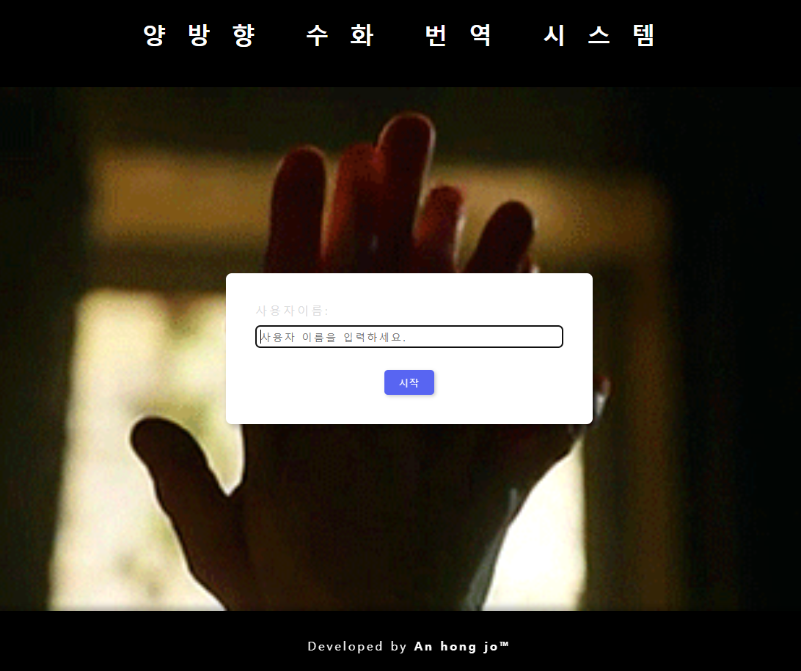
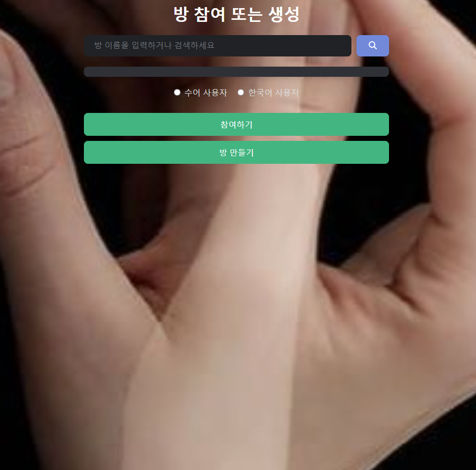
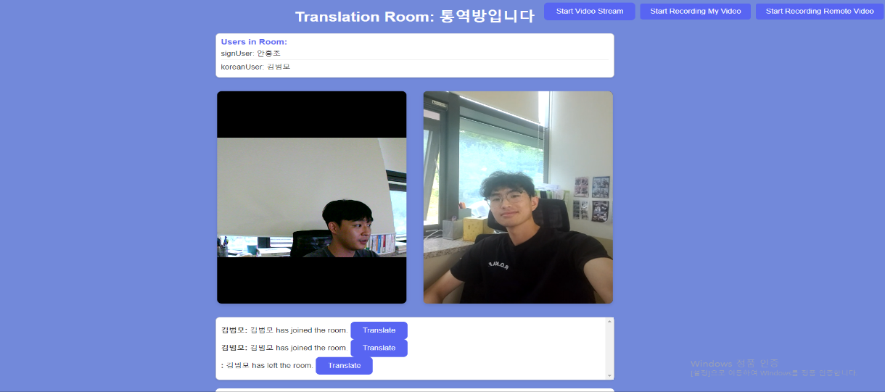
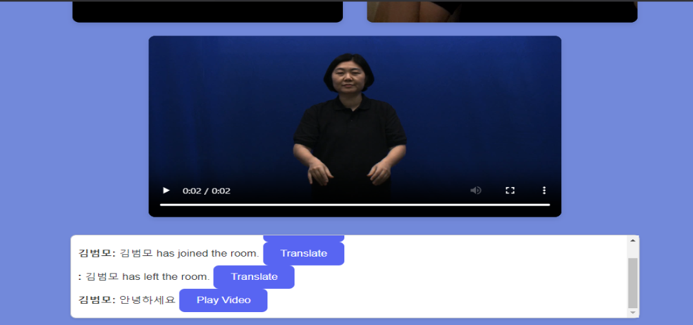
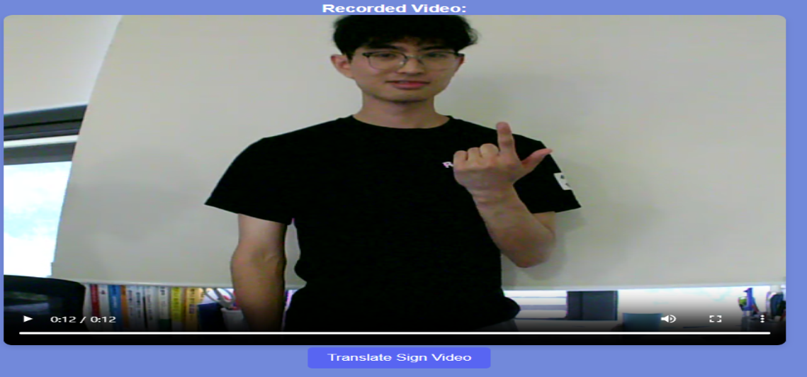
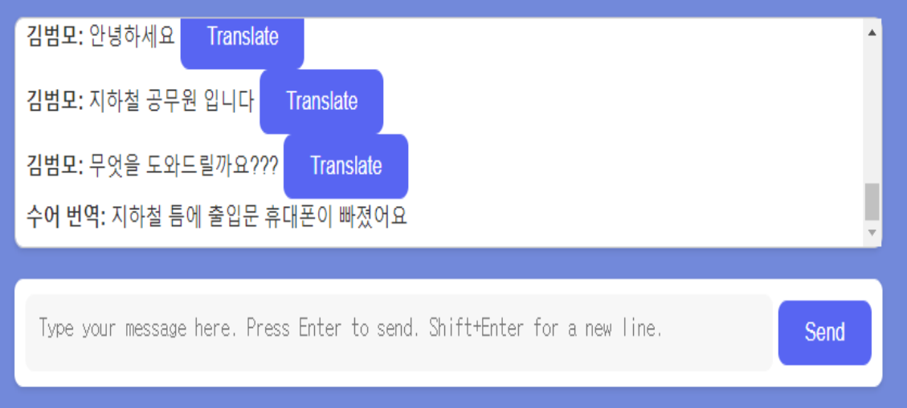

# 👐 Two-way Sign language translation

**Two-way Sign language translationr**는 **Node.js & React** 기반 웹 애플리케이션으로, **수어 → 한국어**와 **한국어 → 수어** 양방향 번역을 제공합니다.

- **수어 영상**을 업로드하면 **수어 문장**(텍스트)으로 변환
- **한국어 문장**을 입력하면 **수어 문장**(텍스트)과 해당 **수어 영상**으로 변환

해당 프로젝트는 **Transformer** 모델과 협업자를 통한 **수어 Detection 모델**을 결합하여, 실시간 수어 번역 및 텍스트 번역을 구현했습니다.

---

## 🔑 **주요 특징**

1. **수어 → 한국어 번역**  
   - **수어 영상** → **수어 문장(텍스트)**(수어 Detection by 김범모) → **한국어 문장** (Transformer)

2. **한국어 → 수어 번역**  
   - **한국어 문장** → **수어 문장** (Transformer) → **수어 영상**(미리 준비된 영상 시퀀스)

3. **Node.js + React** 풀스택  
   - 서버: **Node.js/Express**  
   - 클라이언트: **React** (with Socket.io for real-time communication)

4. **모델 구성**  
   - **Transformer 기반 번역 모델** (자체 학습/파인튜닝)  
   - **수어 Detection 모델** (김김범모 제작, 영상 처리/추론)

---

## 📂 프로젝트 구조

```plaintext
📦 sign-language-translator
├── model/                   # Transformer 모델, vocab, 학습 관련 코드
├── server.js                # Node.js 서버 (Express + Socket.io)
├── client/                  # React 클라이언트
│   ├── src/
│   └── public/
├── .gitignore
├── .env                     # 환경 변수 (민감정보, 모델 경로 등)
├── package.json
└── README.md
```

---

## ⚙️ 설치 및 실행

### 1️⃣ 환경 설정

**Node.js 설치** (v14 이상 권장)

- [Node.js 공식 웹사이트](https://nodejs.org)에서 다운로드 및 설치

**Python 3.8+ 설치** (모델 추론용)

- [Python 공식 웹사이트](https://www.python.org)
- PyTorch, ffmpeg 등 추가 패키지가 필요할 수 있음

**패키지 설치**

서버(sign-language-translator/ 루트 디렉터리)에서:
```bash
npm install
```
클라이언트(sign-language-translator/client/)에서:
```bash
npm install
```

### 2️⃣ 서버/클라이언트 실행

**서버(Node.js)**

```bash
# 루트 디렉터리에서
node server.js
# or
npm run start:server
```

**클라이언트(React)**

```bash
# client 폴더에서
npm run start
```

서버가 5000번 포트, 클라이언트가 3000번 포트에서 실행된다고 가정하면, 브라우저에서 [http://localhost:3000](http://localhost:3000) 으로 접속 가능합니다.

---

## 🗂 데이터셋

### 수어 Detection 학습 데이터

- 김범모가 수집/가공한 수어 영상 + 라벨(문장)
- 일정 수어 단어(“안녕”, “반갑”)의 영상 → 자막(“안녕”, “반갑”)

### 수어 ↔ 한국어 번역 데이터

- 마산 수어통역센터 의뢰를 통해 한국어 번역 데이터셋 일부 커스텀
- 수어 문장(텍스트) ↔ 한국어 문장 페어로 학습

---

## 📸 주요 화면

| 첫 화면 | 방 생성 및 입장 화면 |
| --- | --- |
|  |  |

| 통역 방 화면 | 한국어 → 수어 영상 |
| --- | --- |
|  |  |

| 수어 진행 화면 | 수어 번역 결과 화면 |
| --- | --- |
|  |  |


---
## 👥 협업 기여자

- **김범모**: 수어 Detection 모델 개발, 영상 데이터셋 구축
- **안홍조 (본인)**: Node.js 서버, React 클라이언트, Transformer 모델 파이프라인 구성, 수어 영상 Stitching 및 통합

---

## 🧩 기술 스택

- **Node.js / Express / Socket.io**
- **React** (CRA 기반)
- **PyTorch** (Transformer 모델)
- **FFmpeg** (영상 변환, Stitching)
- **Multer** (파일 업로드)
